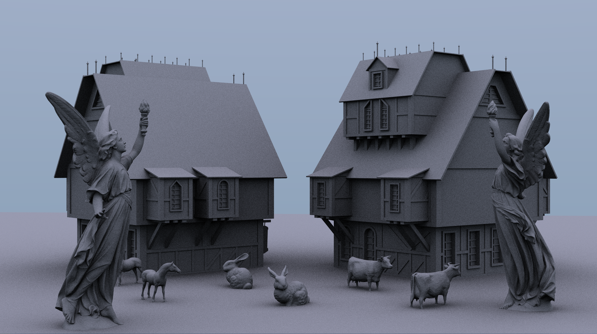

# Mage — Vulkan Raytracing Renderer




At this moment this is a C++20 Vulkan raytracing renderer and a platform to test new techniques I'm interested in. It's still under development and might mutate several times in the future.

## Preface

I'd like to explain what the project is and will be (at least in my mind), together with thoughs behind several choices.

At the very begining, I want to build a small game that doesn't cost too much (so that I could do everything myself) while still expressive. To achive that, I believe 0) all the scenes should be rendered (or enhanced) by raytracing and 1) all the dynamics should be controlled by a physics engine. The gameplay prototype in my mind is a War3 RPG map [Warlock](https://www.warlockbrawl.com/). When I play WoW, I prefer Mage to Warlock and that's why the project's name is "Mage".

After I started working on the project, I soon find that taming the graphics API is already challenging enough for a beginner, so at this moment it is only a ray tracing renderer.

---

I believe that I should always find multiple motivations for everything I choose to do. This project, though far from complete, greatly improves my skills in C++, Vulkan API, and computer graphics. I don't want to kill the goose who laid golden eggs and would like to keep maintaining this project. This implies that the requirements might change frequently while I cannot predict the organization of the whole project in advance, which sounds terrible from a viewpoint of software engineering. I decide to follow a poor man's strategy: just like `std::vector::push_back`, I choose not to employ any unneccesary abstraction and design pattern; instead I'll refactor corresponding codes whenever any code pattern appears the second time. Therefore, some parts of the codes might look only medium-well (or even medium-rare) but I tried to clean the codes and move the unused parts into comments or inactive blocks.

I read several different code samples to learn Vulkan.  Except for the ones with minimal abstraction (e.g. the one from Ray Tracing Gems II), I have to jump between classes and sometimes the IDE is unable to find the correct one for me, which is really frustrating. Also, at this moment the IDE support for C++20 Modules is still premature: for example, Intellisense will complain about class methods from other modules. Given the above considerations, currently most codes are located in the Vulkan wrapper module (but the application part is in a single class and there is no essential difficulty to move it out of the module) and don't use too many OOP abstraction at this moment (and I think when the codes grow, it might be more data driven). For the same reason, I don't separate the module into enough partitions before my IDE could correctly understand the module structure. I hope the situation could improve in the near future.

## Performance

The rendering speed is much faster than I expected. With a desktop GeForce RTX 3070 graphics card, the above scene reaches 30fps at 1440p, 8 samples per pixel and 8 shadow rays per hit for computing AO (i.e. 64 samples per pixel for objects). It seems that most time is spent on the shader codes instead of acceleration structure traversal. Also, there is not significant performance difference in debug and release mode (and whether the validation layer is turned on or not) and this renderer should be completely GPU bottlenecked. Given that this is my first GPU renderer (and Vulkan is my first graphics API), I believe there is still room for significant optimization.

## Technical Thoughts

This is my first GPU renderer and first C++ project approaching 10000 lines. Everything is challenging (more is different) but my skills improve quickly, which is really enjoying. I might write some blogs later when I find or learn something interesting but now let me just write down some random thoughts.

### C++20

* Designated initializers: this is my favorite C++20 feature. In Vulkan parameters are passed by structs and we need to fill in many structs frequently. With designated initializers, codes become cleaner and easier to read:

  ```C++
  blasGeometry = {
  	.sType         {VK_STRUCTURE_TYPE_ACCELERATION_STRUCTURE_GEOMETRY_KHR},
  	.geometryType  {VK_GEOMETRY_TYPE_TRIANGLES_KHR},
  	.geometry      {
  	    .triangles {
  		.sType        {VK_STRUCTURE_TYPE_ACCELERATION_STRUCTURE_GEOMETRY_TRIANGLES_DATA_KHR},
  		.vertexFormat {VK_FORMAT_R32G32B32_SFLOAT},
  		.vertexData   {.deviceAddress = vertexAddress},
  		.vertexStride {sizeof(ObjModel::TriangleVertexType)},
  		.maxVertex    {static_cast<uint32_t>((m_vertexLocations[obj_index] + obj.vertices().size())/3 - 1)},
  		.indexType    {VK_INDEX_TYPE_UINT32},
  		.indexData    {.deviceAddress = indexAddress },
  	    }
  	},
          .flags         { VK_GEOMETRY_OPAQUE_BIT_KHR},
  };
  ```
* Modules: it should have been my favorite C++20 feature. However, the current compiler/IDE support is not satisfying. At early stages of development I struggled with making MSVC and Intellisense work at the same time.
* Concepts: thanks, you saved me from black magic in template programming! More seriously, I think concepts encourage me to use templates to improve my codes.
* Format/{fmt}: it's of no doubt that `std::cout << std::format(...)` is much more pleasant than an iostream chain. I don't want to wait for `std::print` and switch to the {fmt} library. As a byproduct, I soon realize how helpful a colorful logging system could be.
* Ranges: currently only used to replace traditional for-loop. I'm still exploring best practices and more possible applications. It seems that the ranges library might be useful for vertices preprocessing.

### Vulkan and Raytracing

* Vulkan API: it's notorious for having to write thousands of lines before seeing the first triangle. Many suggests to learn an old-style API first but I think it's okay for a beginner to directly work on Vulkan since it helps to build correct frameworks in how to understand and interact with GPU. I think the only problem for a beginner is the tedious initialization process: I spent a lot of time on creating instance, device, swapchain, debug utilities and selecting queues; meanwhile I kept worrying if I did something wrong. [vkbootstrap](https://github.com/charles-lunarg/vk-bootstrap) might be a good choice for simplifying the initialization process.
* Volk: this meta-loader is very helpful when multiple extensions are introduced and ecourages me to try new Vulkan extensions.
* Vulkan-Hpp: unfortunately it didn't work well with the new module system (at least when I created the project). I got hundreds of linking errors and had no idea how to fix them. Also, I want a .cppm Vulkan wrapper instead of a .hpp header file. All of them imply that I have to write my own wrapper. However, it's still quite benificial to check the implementationn of Vulkan-Hpp.
* Raytracing: it's definitely not more difficult than rasterization (for human, since my GPU might have a different option). The only problem is that tutorials are limited and there are hidden issues in each one. However, it pays. After managing to solve all the problems and see the final image, I'm as exciting as defeating a new boss in Dark Souls. Now it's time to explore speedruns and creative builds.

## Roadmap (or task pool)

There are too many things I'd like to try with this project. Here is an incomplete list.

### Rendering

* denoiser
* mixed rendering
* global illumination
* physically-based materials
* scene management
* importance sampling: after finishing the material and scene management module.
* and many more...

### Miscellaneous

* GUI: for monitoring, debugging, and scene editing.
* Cross-platform: after all it's kind of weird that a Vulkan renderer can only run in a single platform.

### Geometry

* Tessellations: the cow whispers to me, "less Picasso and more triangles, please".

### Physics

* Animation

## Building

### Environment

The project is tested with

* Microsoft Visual Studio Community 2022 (64-bit) Version 17.1.0
* CMake 3.23.0-rc2 (3.21 works too. Lower versions don't recognize .cppm files and would be less convenient.)
* Windows 11
* Vulkan 1.3.204
* nVIDIA GeForce RTX 3070

To build and test the renderer, just

1. Generate a Visual Stuido 2022 x64 project with CMake 3.21 or higher,
2. Build and run!

Random thoughts:

1. Since I don't have other graphics cards, the renderer might not work well when multiple GPUs are available. Besides, some GPUs might provide a different combination of queue families and I'm not sure if this renderer could run in that case. However, only some minor adjustments are needed to work in those cases. Given that the renderer might be refactored several times, it might be fixed in the future.
2. There is no essential difficulty in supporting gcc/clang and Linux. The codes don't depend on any platform/compiler specific feature and Vulkan itself provides a cross-platform abstraction of GPU. However, at the moment I started working on the project (late September of 2021), the only build system / compiler with (almost) complete C++20 support is MSBuild / MSVC. For those major C++20 features used in this project,  `<format>` could and has already been replaced by `<fmt>`, `<ranges>` could be replaced by `<range-v3>` , no dependency on `<coroutine>` , but there is no workaround for C++20 Modules (especially module partitions). For build systems, CMake itself doesn't understand module dependencies and I have to use MSBuild. I heard that xmake recently improved its support for C++20 Modules and I will try it in the future.

### Dependencies

The project is built from scratch and only necessary third-party libraries are included.

Vulkan SDK is the only one that must be installed in advance. All other dependencies is included in the repository or will be fetched by CPM (which itself is in the .../CMake directory).

#### Packages in the repository

[CPM.cmake](https://github.com/cpm-cmake/CPM.cmake "a CMake script that adds dependency management capabilities to CMake"): a CMake script that adds dependency management capabilities to CMake.

[tinyobjloader (optimized)](https://github.com/tinyobjloader/tinyobjloader#optimized-loader "a multi-threaded wavefront obj loader"): a wavefront obj loader. Although model loading is not the bottleneck in any sense, I choose to include the optimized multi-threaded version, which is not compatible with C++20. The one included in the `Includes/` directory is a modififed version (the original one uses something removed in C++20).

#### Packages fetched by CPM

[{fmt}](https://github.com/fmtlib/fmt "a formatting library, used to replace C++20 `<format>` library and provide colorful logs"): a formatting library, used to replace C++20 `<format>` library and provide colorful logs.

[GLFW](https://github.com/glfw/glfw "a simple, platform-independent API for creating windows, surfaces and handling keyboard events"): a simple, platform-independent API for creating windows, surfaces and handling keyboard events.

[glm](https://github.com/g-truc/glm "a linear algebra library for providing data compatible with GLSL"): a linear algebra library for providing data compatible with GLSL.

[volk](https://github.com/zeux/volk "a meta-loader for Vulkan"): a meta-loader for Vulkan.

[Vulkan Memory Allocator](https://github.com/GPUOpen-LibrariesAndSDKs/VulkanMemoryAllocator "a library for `VkBuffer` and `VkImage` allocation."): a library for `VkBuffer` and `VkImage` allocation.

##### ... but haven't been used yet

[Dear ImGui](https://github.com/ocornut/imgui "an immediate-mode-GUI library, will be used for GUI"): an immediate-mode-GUI library. It will be used for GUI.

[Eigen](https://gitlab.com/libeigen/eigen "a C++ template library for linear algebra and simple SIMD support, will be used for the physics engine"): a C++ template library for linear algebra and simple SIMD support. It will be used for the physics engine.

[stb](https://github.com/nothings/stb "an image loader, will be used for loading textures"): an image loader. It will be used for loading textures.

### Control

A simple tank control system:

WASD for moving, QE for turning left and right, 1/3 for increasing/decreasing speed, 2 for returning to initial speed.

Currently it's only for debugging and is kind of cumbersome. I plan to add controller support and improve keyboard control in the future.

## References

### Vulkan API

https://github.com/Overv/VulkanTutorial

https://github.com/GavinKG/ILearnVulkanFromScratch-CN

https://github.com/vblanco20-1/vulkan-guide

https://github.com/PacktPublishing/Learning-Vulkan

https://www.khronos.org/registry/vulkan/specs/1.3-extensions/html/index.html

### Ray tracing

Ray Tracing Gems I & II (currently shaders are based on Chapter 16 of Ray Tracing Gems II and will be replaced by self-created ones in the next version)

https://nvpro-samples.github.io/vk_mini_path_tracer/index.html

https://nvpro-samples.github.io/vk_raytracing_tutorial_KHR

https://github.com/GPSnoopy/RayTracingInVulkan (I read some codes from this one but I failed to figure out how to build `<Boost>` on my computer and hence cannot test it. Nevertheless, this is still the one that persuaded me that a non-expert could build a real-time ray tracing renderer from scratch within 10000 lines of codes)

https://www.gsn-lib.org/docs/nodes/raytracing.php (A raytracing shadertoy)
